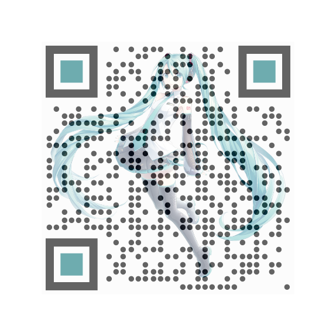

# react-qrcode-logo

Typescript React component to generate a customizable QR Code.

<div style="display: flex; flex-direction: row;">
 
 
 
</div>

## Installation

```bash
npm install --save react-qrcode-logo
```

## Usage

```javascript
// import
import { QRCode } from 'react-qrcode-logo';

// usage
<QRCode value="https://github.com/gcoro/react-qrcode-logo" />

```

## Compatibility

If you are using a React version >= 18, use react-qrcode-logo version >= 3.0.0

## Props

| Prop                     | Type                                | Default value       | Description                                                                                                                      |
|--------------------------|-------------------------------------| --------------------|----------------------------------------------------------------------------------------------------------------------------------|
| `value`                  | `string`                            | `https://reactjs.org/` | The value encoded in the QR Code. When the QR Code is decoded, this value will be returned                                         |
| `ecLevel`                | `L` &#124; `M` &#124; `Q` &#124; `H` |   `M`              | The error correction level of the QR Code                                                                                          |
| `enableCORS`             | `boolean`                           |   `false`           | Enable crossorigin attribute                                                                                                       |
| `size`                   | `number` (in pixels)                |   `150`             | The size of the QR Code                                                                                                            |
| `quietZone`              | `number` (in pixels)                |   `10`              | The size of the quiet zone around the QR Code. This will have the same color as QR Code bgColor                                    |
| `bgColor`                | `string` (css color)                | `#FFFFFF`           | Background color                                                                                                                   |
| `fgColor`                | `string` (css color)                | `#000000`           | Foreground color                                                                                                                   |
| `logoImage`              | `string` (src attribute)            |                     | The logo image. It can be a url/path or a base64 value                                                                             |
| `logoWidth`              | `number` (in pixels)                | `size * 0.2`        | Logo image width                                                                                                                   |
| `logoHeight`             | `number` (in pixels)                | `logoWidth`                  | Logo image height                                                                                                                  |
| `logoOpacity`            | `number` (css opacity 0 <= x <= 1)  | `1`                 | Logo opacity. This allows you to modify the transparency of your logo, so that it won't compromise the readability of the QR Code  |
| `removeQrCodeBehindLogo` | `boolean`                           |   `false`           | Removes points behind the logo. If no logoPadding is specified, the removed part will have the same size as the logo                                                    |
| `logoPadding`            | `number`                            |                     | Adds a border with no points around the logo. When > 0, the padding will be visible even if the prop removeQrCodeBehindLogo is not set to true                                                    |
| `logoPaddingStyle`            | `square` &#124; `circle`        | `square`     | Sets the shape of the padding area around the logo                                                     |
| `qrStyle`                | `squares` &#124; `dots` &#124; `fluid`            | `squares`  | Style of the QR Code modules                                                                                                       |
| `eyeRadius`              | `CornerRadii` &#124; `CornerRadii[]` |  | The corner radius for the positional patterns (the three "eyes" around the QR code). [See more details here](res/eyeRadius_doc.md) |
| `eyeColor`               | `EyeColor` &#124; `EyeColor[]`      |  | The color for the positional patterns (the three "eyes" around the QR code). [See more details here](res/eyeColor_doc.md)          |
| `id`                     | `string`                            | `react-qrcode-logo` | Optional custom id for the QRCode canvas. You can use this prop if you have multiple QRCodes and need to differentiate them        |
| `style`       | `React.CSSProperties` |  | CSS style properties that will be applied to the canvas component |

## Events

| Event Name                     | Returns                                | Description                                                                                                                      |
|--------------------------|-------------------------------------| ----------------------------------------------------------------------------------------------------------------------------------|
| `logoOnLoad`                    | `event: Event`                            | Event that fires when the QR Code logo image has been loaded                                         |

## Methods

Methods must be called on a valid QRCode ref - [learn more](https://react.dev/learn/manipulating-the-dom-with-refs). 

| Method Name                     | Arguments                                | Description                                                                                                                      |
|--------------------------|-------------------------------------| ----------------------------------------------------------------------------------------------------------------------------------|
| `download`                  | `fileType?`: `'png'` &#124; `'jpg'` &#124; `'webp'`, `fileName?: string`                            | This function will download the QR Code as image. Format and file name can be specified                                         |

## Example

You can find a demo project [here](https://github.com/gcoro/QRCodeCustomizer).

## Contributing

PRs and suggestions are welcome.
When making a pull request, please explain in a clear way the changes you made and why you are making them (+ if you can also update the README accordingly, ty <3).
Also try keep the current repo codestyle (eg. do not reformat all the code with prettier).

Thanks to everyone who contributed and/or will contribute :)

## More credits

This package was inspired by [cssivision/qrcode-react](https://github.com/cssivision/qrcode-react) and [zpao/qrcode.react](https://github.com/zpao/qrcode.react). Also looked up some parts from [kazuhikoarase/qrcode-generator](https://github.com/kazuhikoarase/qrcode-generator) (which this package depends on).
